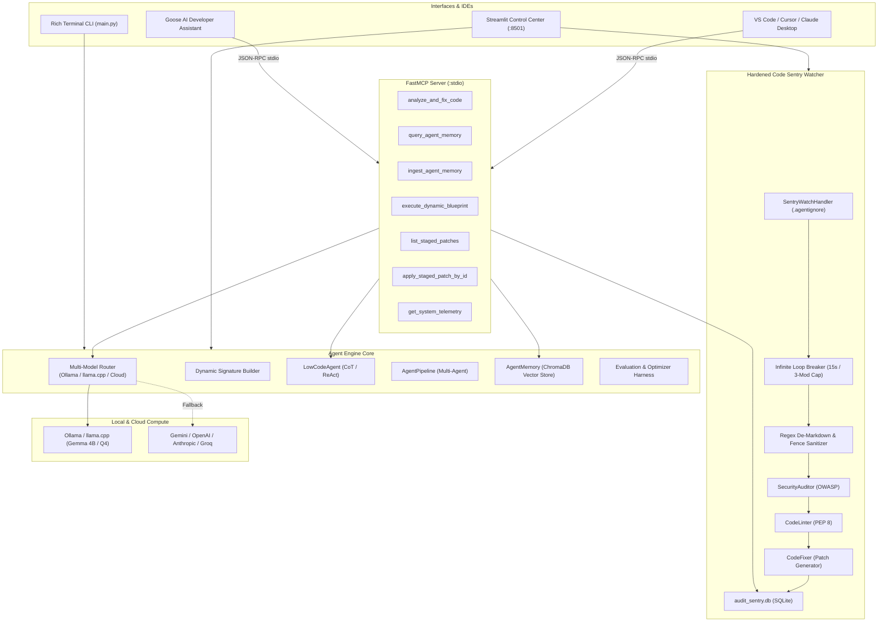

# Autonomous Agent Engine: Master System Blueprint & Verification Report

> [!NOTE]
> **Project Location:** [`/home/nadir/agent_engine`](file:///home/nadir/agent_engine)  
> **Interactive Tutorial Guide:** [`/home/nadir/Documents/agent_engine_guide.html`](file:///home/nadir/Documents/agent_engine_guide.html)  
> **Streamlit Operations Center:** `http://localhost:8501`

---

## 1. System Architecture



---

## 2. Directory Layout & Implemented Components

| Component | File Path | Description |
| :--- | :--- | :--- |
| **Dynamic Compiler** | [`core/engine.py`](file:///home/nadir/agent_engine/core/engine.py) | Dynamic signature generation and runtime compilation into `ChainOfThought`, `ReAct`, or `Predict`. |
| **Multi-Model Router** | [`core/router.py`](file:///home/nadir/agent_engine/core/router.py) | Multi-provider router with local health checks (Ollama/llama.cpp) and cloud fallback. |
| **RAG Vector Memory** | [`core/memory.py`](file:///home/nadir/agent_engine/core/memory.py) | Persistent ChromaDB vector database for embeddings, semantic search, and context retrieval. |
| **Optimizer Harness** | [`core/harness.py`](file:///home/nadir/agent_engine/core/harness.py) | Automated prompt evaluation and self-improvement compilation via `BootstrapFewShot`. |
| **Hardened Code Sentry**| [`server/watcher.py`](file:///home/nadir/agent_engine/server/watcher.py) | Filesystem watcher with 3-tier audit chain, loop breaker, and SQLite patch staging database. |
| **FastMCP Server** | [`server/mcp_server.py`](file:///home/nadir/agent_engine/server/mcp_server.py) | Exposes 7 native IDE tools over stdio for VS Code, Claude Desktop, Cursor, and Goose AI. |
| **Streamlit Studio** | [`server/dashboard.py`](file:///home/nadir/agent_engine/server/dashboard.py) | Web control center on port 8501 for live telemetry, patch approvals, and speedometers. |
| **Master CLI** | [`main.py`](file:///home/nadir/agent_engine/main.py) | Unified CLI with `status`, `watch`, `staged`, `apply`, `mcp`, `dashboard`, and `rag-demo`. |
| **Exclusions Filter** | [`.agentignore`](file:///home/nadir/agent_engine/.agentignore) | Pattern matcher ignoring `.venv/`, `__pycache__/`, database files, and watcher daemons. |

---

## 3. Production Hardening Features

> [!IMPORTANT]
> **Infinite Loop Breaker (`server/watcher.py`)**:
> - Implements a sliding 15-second modification window (`auto_apply_history`).
> - If a file is auto-patched > 3 times within 15 seconds, the watcher locks auto-apply for that file and safely stages the patch in SQLite for manual human review, preventing thrashing and infinite loops.

> [!TIP]
> **De-Markdown Syntax Sanitizer (`server/watcher.py`)**:
> - Multi-line regex pattern matcher (`r"```(?:python|py)?\s*\n([\s\S]*?)\n```"`) strips markdown code fences, headers, and model conversational commentary before saving to disk.

---

## 4. Test Verification Matrix (12 / 12 Tests Passed — 100%)

```text
tests/test_engine.py::test_dynamic_signature_generation PASSED           [  8%]
tests/test_engine.py::test_lowcode_agent_initialization PASSED           [ 16%]
tests/test_engine.py::test_agent_memory_persistence PASSED               [ 25%]
tests/test_engine.py::test_router_status_and_instantiation PASSED        [ 33%]
tests/test_mcp.py::test_mcp_tool_registration PASSED                     [ 41%]
tests/test_mcp.py::test_system_telemetry_tool PASSED                     [ 50%]
tests/test_mcp.py::test_mcp_memory_lifecycle PASSED                      [ 58%]
tests/test_mcp.py::test_list_staged_patches_tool PASSED                  [ 66%]
tests/test_watcher.py::test_agentignore_filter PASSED                    [ 75%]
tests/test_watcher.py::test_staging_database_flow PASSED                 [ 83%]
tests/test_watcher.py::test_patch_engine_sanitizer PASSED                [ 91%]
tests/test_watcher.py::test_infinite_loop_breaker PASSED                 [100%]

============================== 12 passed in 5.03s ==============================
```

---

## 5. Master CLI Command Quick-Reference

| Command | Purpose |
| :--- | :--- |
| `/home/nadir/agent_engine/.venv/bin/python /home/nadir/agent_engine/main.py dashboard` | **Launch Web Dashboard (`http://localhost:8501`)** |
| `/home/nadir/agent_engine/.venv/bin/python /home/nadir/agent_engine/main.py watch` | **Start Code Sentry (Safe Staging Mode)** |
| `/home/nadir/agent_engine/.venv/bin/python /home/nadir/agent_engine/main.py watch --auto-apply` | **Start Code Sentry (Auto-Apply Mode)** |
| `/home/nadir/agent_engine/.venv/bin/python /home/nadir/agent_engine/main.py status` | **Check Health & Provider Status** |
| `/home/nadir/agent_engine/.venv/bin/python /home/nadir/agent_engine/main.py staged` | **List Staged Patches in SQLite** |
| `/home/nadir/agent_engine/.venv/bin/python /home/nadir/agent_engine/main.py apply <id>` | **Apply Staged Patch to File** |
| `/home/nadir/agent_engine/.venv/bin/python /home/nadir/agent_engine/main.py mcp` | **Start FastMCP Server for IDEs** |
| `/home/nadir/agent_engine/.venv/bin/pytest /home/nadir/agent_engine/tests/ -v` | **Run Full Test Suite** |

---

## 6. IDE Configuration (FastMCP)

Add this configuration to your `claude_desktop_config.json` or VS Code / Cursor MCP settings:

```json
{
  "mcpServers": {
    "agent-engine": {
      "command": "/home/nadir/agent_engine/.venv/bin/python",
      "args": [
        "/home/nadir/agent_engine/server/mcp_server.py"
      ],
      "env": {
        "PYTHONPATH": "/home/nadir/agent_engine"
      }
    }
  }
}
```
